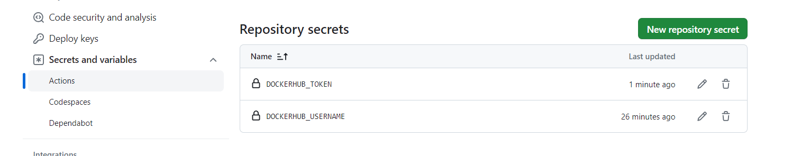
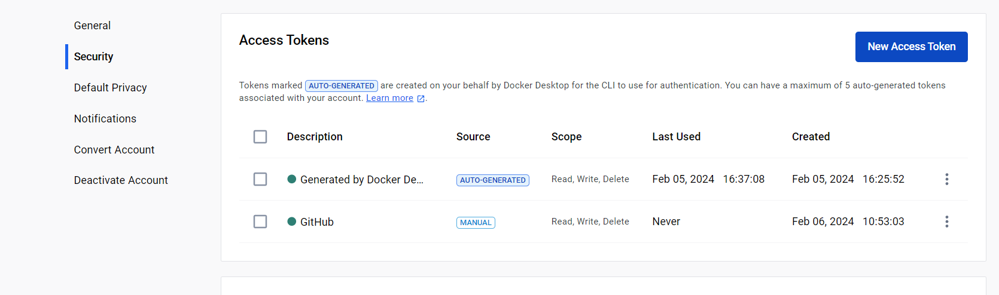

mvn clean verify

=> creation dossier target 

Attention mettre son jdk à jour 
 sudo apt-get install default-jdk

 jdk 17 : 

 sudo add-apt-repository ppa:linuxuprising/java
  sudo apt install oracle-java17-installer
# Questions

2-1 Que sont les conteneurs de test?
  Testcontainers est une bibliothèque Java qui fournit des instances légères et jetables de bases de données courantes. Elle prend en charge les tests JUnit et est distribuée sous forme de JAR distincts avec un numéro de version commun. 
  Les conteneurs de test facilitent différents types de tests, tels que les tests d'intégration des couches d'accès aux données, les tests d'interface utilisateur/acceptation et les tests d'intégration des applications. Ils permettent de définir les dépendances des tests en tant que code, ce qui évite d'avoir recours à des mocks ou à des configurations d'environnement compliquées. Testcontainers est disponible en tant que dépendance Maven, et la dernière dépendance Maven de la bibliothèque principale est "org.testcontainers:testcontainers

  Ce sont simplement des bibliothèques java qui vous permettent d'exécuter un tas de conteneurs docker pendant les tests

main.yml

name: CI devops 2024
on:
  #to begin you want to launch this job in main and develop
  push:
    # on donne les branches à tester (la develop existe pas encore)
    branches:
      - main
  pull_request:

jobs:
  test-backend:
    runs-on: ubuntu-22.04
    steps:
      #checkout your github code using actions/checkout@v2.5.0
      - uses: actions/checkout@v2.5.0

      #do the same with another action (actions/setup-java@v3) that enable to setup jdk 17
      - name: Set up JDK 17
      # on utilise l'action setup java officiel
        uses: actions/setup-java@v4
        with:
          # on utilise le même jdk que le Dockerfile
          distribution: 'corretto'
          # on précise la même version que le Dockerfile
          java-version: '17'

      #finally build your app with the latest command
      - name: Build and test with Maven
        #on run maven clean verify dans le dossier du backend
        run: mvn clean verify --file ./TP1/API/simple-api-student-main/simple-api-student-main/pom.xml

ATT : 

2-1 What are testcontainers?
2-2 Document your Github Actions configurations

