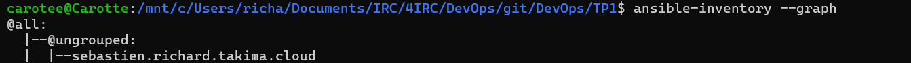

ansible all -m ping --private-key=/home/carotee/cpe/id_rsa -u centos

$ ansible all -m yum -a "name=httpd state=present" --private-key=/home/carotee/cpe/id_rsa -u centos

$ ansible all -m shell -a 'echo "<html><h1>Hello World</h1></html>" >> /var/www/html/index.html' --private-key=/home/carotee/cpe/id_rsa -u centos --become

---
BECOME  !! 
$ ansible all -m shell -a 'echo "<html><h1>Hello World</h1></html>" >> /var/www/html/index.html' --private-key=/home/carotee/cpe/id_rsa -u centos --become

$ ansible all -m service -a "name=httpd state=started" --private-key=/home/carotee/cpe/id_rsa -u centos --become

----

ansible all -i inventories/setup.yml -m ping
/code 

 ansible all -i inventories/setup.yml -m setup -a "filter=ansible_distribution*"
sebastien.richard.takima.cloud | SUCCESS => {
    "ansible_facts": {
        "ansible_distribution": "CentOS",
        "ansible_distribution_file_parsed": true,
        "ansible_distribution_file_path": "/etc/redhat-release",
        "ansible_distribution_file_variety": "RedHat",
        "ansible_distribution_major_version": "7",
        "ansible_distribution_release": "Core",
        "ansible_distribution_version": "7.9",
        "discovered_interpreter_python": "/usr/bin/python"
    },
    "changed": false
}

ansible all -i inventories/setup.yml -m yum -a "name=httpd state=absent" --become

ansible all -i inventories/setup.yml -m yum -a "name=httpd state=present" --become

3$ ansible-playbook -i inventories/setup.yml playbook.yml

PLAY [all] ************************************************************************************************

TASK [Test connection] ************************************************************************************
ok: [sebastien.richard.takima.cloud]

PLAY RECAP ************************************************************************************************
sebastien.richard.takima.cloud : ok=1    changed=0    unreachable=0    failed=0    skipped=0    rescued=0    ignored=0

ansible-galaxy init roles/docker
- Role roles/docker was created successfully

ansible-playbook playbooks/network-test.yaml -e "network=asa"

ansible-galaxy collection install community.docker

change l'ordre dans playbook important

docker network ls

sudo docker network inspect my-network

ansible-playbook -i inventories/setup.yml playbook.yml -vvv

API

database

docker exec <container_id> env

sudo docker exec database env
PATH=/usr/local/sbin:/usr/local/bin:/usr/sbin:/usr/bin:/sbin:/bin
HOSTNAME=d8a2f56b059a
POSTGRES_DB=db
POSTGRES_USER=usr
POSTGRES_PASSWORD=pwd
LANG=en_US.utf8
PG_MAJOR=14
PG_VERSION=14.1
PG_SHA256=4d3c101ea7ae38982f06bdc73758b53727fb6402ecd9382006fa5ecc7c2ca41f
PGDATA=/var/lib/postgresql/data
HOME=/root

docker images -a 

REPOSITORY                                   TAG       IMAGE ID       CREATED             SIZE
carottealpha/tp-devops-simple-api            latest    57c5bb3a16d7   About an hour ago   504MB
carottealpha/tp-devops-simple-api-httpd      latest    02809a79f842   25 hours ago        167MB
carottealpha/tp-devops-simple-api-database   latest    64b12c6bc6c4   25 hours ago        209MB
[root@ip-10-0-1-52 centos]# docker rmi 57c5bb3a16d7
Error response from daemon: conflict: unable to delete 57c5bb3a16d7 (must be forced) - image is being used by stopped container 9568591d4ccc
[root@ip-10-0-1-52 centos]# docker stop  9568591d4ccc
9568591d4ccc
[root@ip-10-0-1-52 centos]# docker rmi 57c5bb3a16d7
Error response from daemon: conflict: unable to delete 57c5bb3a16d7 (must be forced) - image is being used by stopped container 9568591d4ccc
[root@ip-10-0-1-52 centos]# docker rmi -f 57c5bb3a16d7
Untagged: carottealpha/tp-devops-simple-api:latest
Untagged: carottealpha/tp-devops-simple-api@sha256:de27840f8cb7ab6e6577cd3e1fc1bf59ee7da66d035b27efd4a10db867992650
Deleted: sha256:57c5bb3a16d74dffa4464de037e0817ec69f840aced8541efcbcdffe3ba2b84b
[root@ip-10-0-1-52 centos]# docker rmi -f 02809a79f842
Untagged: carottealpha/tp-devops-simple-api-httpd:latest
Untagged: carottealpha/tp-devops-simple-api-httpd@sha256:1354afc67a466df0ce351770e4f34978b85dbc896ac600b8d65a0bf89d7526bf
Deleted: sha256:02809a79f8426f9f55dc44f67417c603fe82e8e54f8ec709bb01864cd6adcf0f
[root@ip-10-0-1-52 centos]# docker rmi -f 64b12c6bc6c4
Untagged: carottealpha/tp-devops-simple-api-database:latest
Untagged: carottealpha/tp-devops-simple-api-database@sha256:db281988c5a5312867e2b521cdf65c02db3cb8217541c1c292a0b1ddaa4fd084
Deleted: sha256:64b12c6bc6c4965717431921508606b1a9966748aa4def874364975d35cc1656
[root@ip-10-0-1-52 centos]# docker images
REPOSITORY   TAG       IMAGE ID   CREATED   SIZE

Supprimer tout !

docker rm -f $(docker ps -a -q) 

safe main.yml network

---
# tasks file for roles/network
- name: Connect multiple containers to the network
  community.docker.docker_network:
    name: my-network
    state: present
    containers:
      - database
      - httpd
      - api

docker exec -it pg cat /var/lib/postgresql/data/pg_hba.conf
# PostgreSQL Client Authentication Configuration File
# ===================================================
#
# Refer to the "Client Authentication" section in the PostgreSQL
# documentation for a complete description of this file.  A short
# synopsis follows.
#
# This file controls: which hosts are allowed to connect, how clients
# are authenticated, which PostgreSQL user names they can use, which
# databases they can access.  Records take one of these forms:
#
# local         DATABASE  USER  METHOD  [OPTIONS]
# host          DATABASE  USER  ADDRESS  METHOD  [OPTIONS]
# hostssl       DATABASE  USER  ADDRESS  METHOD  [OPTIONS]
# hostnossl     DATABASE  USER  ADDRESS  METHOD  [OPTIONS]
# hostgssenc    DATABASE  USER  ADDRESS  METHOD  [OPTIONS]
# hostnogssenc  DATABASE  USER  ADDRESS  METHOD  [OPTIONS]
#
# (The uppercase items must be replaced by actual values.)
#
# The first field is the connection type:
# - "local" is a Unix-domain socket
# - "host" is a TCP/IP socket (encrypted or not)
# - "hostssl" is a TCP/IP socket that is SSL-encrypted
# - "hostnossl" is a TCP/IP socket that is not SSL-encrypted
# - "hostgssenc" is a TCP/IP socket that is GSSAPI-encrypted
# - "hostnogssenc" is a TCP/IP socket that is not GSSAPI-encrypted
#
# DATABASE can be "all", "sameuser", "samerole", "replication", a
# database name, or a comma-separated list thereof. The "all"
# keyword does not match "replication". Access to replication
# must be enabled in a separate record (see example below).
#
# USER can be "all", a user name, a group name prefixed with "+", or a
# comma-separated list thereof.  In both the DATABASE and USER fields
# you can also write a file name prefixed with "@" to include names
# from a separate file.
#
# ADDRESS specifies the set of hosts the record matches.  It can be a
# host name, or it is made up of an IP address and a CIDR mask that is
# an integer (between 0 and 32 (IPv4) or 128 (IPv6) inclusive) that
# specifies the number of significant bits in the mask.  A host name
# that starts with a dot (.) matches a suffix of the actual host name.
# Alternatively, you can write an IP address and netmask in separate
# columns to specify the set of hosts.  Instead of a CIDR-address, you
# can write "samehost" to match any of the server's own IP addresses,
# or "samenet" to match any address in any subnet that the server is
# directly connected to.
#
# METHOD can be "trust", "reject", "md5", "password", "scram-sha-256",
# "gss", "sspi", "ident", "peer", "pam", "ldap", "radius" or "cert".
# Note that "password" sends passwords in clear text; "md5" or
# "scram-sha-256" are preferred since they send encrypted passwords.
#
# OPTIONS are a set of options for the authentication in the format
# NAME=VALUE.  The available options depend on the different
# authentication methods -- refer to the "Client Authentication"
# section in the documentation for a list of which options are
# available for which authentication methods.
#
# Database and user names containing spaces, commas, quotes and other
# special characters must be quoted.  Quoting one of the keywords
# "all", "sameuser", "samerole" or "replication" makes the name lose
# its special character, and just match a database or username with
# that name.
#
# This file is read on server startup and when the server receives a
# SIGHUP signal.  If you edit the file on a running system, you have to
# SIGHUP the server for the changes to take effect, run "pg_ctl reload",
# or execute "SELECT pg_reload_conf()".
#
# Put your actual configuration here
# ----------------------------------
#
# If you want to allow non-local connections, you need to add more
# "host" records.  In that case you will also need to make PostgreSQL
# listen on a non-local interface via the listen_addresses
# configuration parameter, or via the -i or -h command line switches.

# CAUTION: Configuring the system for local "trust" authentication
# allows any local user to connect as any PostgreSQL user, including
# the database superuser.  If you do not trust all your local users,
# use another authentication method.

# TYPE  DATABASE        USER            ADDRESS                 METHOD

# "local" is for Unix domain socket connections only
local   all             all                                     trust
# IPv4 local connections:
host    all             all             127.0.0.1/32            trust
# IPv6 local connections:
host    all             all             ::1/128                 trust
# Allow replication connections from localhost, by a user with the
# replication privilege.
richa\Documents\IRC\4IRC\DevOps\git\DevOps\TP1>

docker inspect api
[
    {
        "Id": "761ea65215c3928c5acde62c3d083eb67c20f7670aff2996ed0e7b39cc170f7a",
        "Created": "2024-02-07T21:44:44.075961166Z",
        "Path": "/bin/sh",
        "Args": [
            "-c",
            "java -jar myapp.jar"
        ],
        "State": {
            "Status": "exited",
            "Running": false,
            "Paused": false,
            "Restarting": false,
            "OOMKilled": false,
            "Dead": false,
            "Pid": 0,
            "ExitCode": 1,
            "Error": "",
            "StartedAt": "2024-02-07T21:59:20.275913549Z",
            "FinishedAt": "2024-02-07T21:59:25.698409139Z"
        },
        "Image": "sha256:8d37ccc254345e26ebdee406110a8d50a164182d47fdd33a2474bde1302940a5",
        "ResolvConfPath": "/var/lib/docker/containers/761ea65215c3928c5acde62c3d083eb67c20f7670aff2996ed0e7b39cc170f7a/resolv.conf",
        "HostnamePath": "/var/lib/docker/containers/761ea65215c3928c5acde62c3d083eb67c20f7670aff2996ed0e7b39cc170f7a/hostname",
        "HostsPath": "/var/lib/docker/containers/761ea65215c3928c5acde62c3d083eb67c20f7670aff2996ed0e7b39cc170f7a/hosts",
        "LogPath": "/var/lib/docker/containers/761ea65215c3928c5acde62c3d083eb67c20f7670aff2996ed0e7b39cc170f7a/761ea65215c3928c5acde62c3d083eb67c20f7670aff2996ed0e7b39cc170f7a-json.log",
        "Name": "/api",
        "RestartCount": 0,
        "Driver": "overlay2",
        "Platform": "linux",
        "MountLabel": "",
        "ProcessLabel": "",
        "AppArmorProfile": "",
        "ExecIDs": null,
        "HostConfig": {
            "Binds": null,
            "ContainerIDFile": "",
            "LogConfig": {
                "Type": "json-file",
                "Config": {}
            },
            "NetworkMode": "tp1_app-network",
            "PortBindings": {},
            "RestartPolicy": {
                "Name": "",
                "MaximumRetryCount": 0
            },
            "AutoRemove": false,
            "VolumeDriver": "",
            "VolumesFrom": null,
            "CapAdd": null,
            "CapDrop": null,
            "CgroupnsMode": "host",
            "Dns": null,
            "DnsOptions": null,
            "DnsSearch": null,
            "ExtraHosts": [],
            "GroupAdd": null,
            "IpcMode": "private",
            "Cgroup": "",
            "Links": null,
            "OomScoreAdj": 0,
            "PidMode": "",
            "Privileged": false,
            "PublishAllPorts": false,
            "ReadonlyRootfs": false,
            "SecurityOpt": null,
            "UTSMode": "",
            "UsernsMode": "",
            "ShmSize": 67108864,
            "Runtime": "runc",
            "ConsoleSize": [
                0,
                0
            ],
            "Isolation": "",
            "CpuShares": 0,
            "Memory": 0,
            "NanoCpus": 0,
            "CgroupParent": "",
            "BlkioWeight": 0,
            "BlkioWeightDevice": null,
            "BlkioDeviceReadBps": null,
            "BlkioDeviceWriteBps": null,
            "BlkioDeviceReadIOps": null,
            "BlkioDeviceWriteIOps": null,
            "CpuPeriod": 0,
            "CpuQuota": 0,
            "CpuRealtimePeriod": 0,
            "CpuRealtimeRuntime": 0,
            "CpusetCpus": "",
            "CpusetMems": "",
            "Devices": null,
            "DeviceCgroupRules": null,
            "DeviceRequests": null,
            "KernelMemory": 0,
            "KernelMemoryTCP": 0,
            "MemoryReservation": 0,
            "MemorySwap": 0,
            "MemorySwappiness": null,
            "OomKillDisable": false,
            "PidsLimit": null,
            "Ulimits": null,
            "CpuCount": 0,
            "CpuPercent": 0,
            "IOMaximumIOps": 0,
            "IOMaximumBandwidth": 0,
            "MaskedPaths": [
                "/proc/asound",
                "/proc/acpi",
                "/proc/kcore",
                "/proc/keys",
                "/proc/latency_stats",
                "/proc/timer_list",
                "/proc/timer_stats",
                "/proc/sched_debug",
                "/proc/scsi",
                "/sys/firmware"
            ],
            "ReadonlyPaths": [
                "/proc/bus",
                "/proc/fs",
                "/proc/irq",
                "/proc/sys",
                "/proc/sysrq-trigger"
            ]
        },
        "GraphDriver": {
            "Data": {
                "LowerDir": "/var/lib/docker/overlay2/d9bac911567768b41eb8880b76e2cc06e228f6d376bdb0d2377b753357043763-init/diff:/var/lib/docker/overlay2/b2be4ca6a24529ef17b675bc44acf86386c03f2604e41ee4113c3769ac9be25f/diff:/var/lib/docker/overlay2/317c6b1511d23f9726d583a52b5193d85613a5affcbc42d59ea97a89726aad94/diff:/var/lib/docker/overlay2/98faefbb3793ff20d71ffb720c506296570ef1d1a4727ab7ac0393ef2a0feea3/diff:/var/lib/docker/overlay2/7fc597206a530b0740a227fedf5bb115760eef53597cf8555950ad23a527aa81/diff",
                "MergedDir": "/var/lib/docker/overlay2/d9bac911567768b41eb8880b76e2cc06e228f6d376bdb0d2377b753357043763/merged",
                "UpperDir": "/var/lib/docker/overlay2/d9bac911567768b41eb8880b76e2cc06e228f6d376bdb0d2377b753357043763/diff",
                "WorkDir": "/var/lib/docker/overlay2/d9bac911567768b41eb8880b76e2cc06e228f6d376bdb0d2377b753357043763/work"
            },
            "Name": "overlay2"
        },
        "Mounts": [],
        "Config": {
            "Hostname": "761ea65215c3",
            "Domainname": "",
            "User": "",
            "AttachStdin": false,
            "AttachStdout": true,
            "AttachStderr": true,
            "Tty": false,
            "OpenStdin": false,
            "StdinOnce": false,
            "Env": [
                "URL=jdbc:postgresql://database:5432/db",
                "USER=usr",
                "PWD=pwd",
                "PATH=/usr/local/sbin:/usr/local/bin:/usr/sbin:/usr/bin:/sbin:/bin",
                "LANG=C.UTF-8",
                "JAVA_HOME=/usr/lib/jvm/java-17-amazon-corretto",
                "MYAPP_HOME=/opt/myapp"
            ],
            "Cmd": null,
            "Image": "carottealpha/tp-devops-simple-api",
            "Volumes": null,
            "WorkingDir": "/opt/myapp",
            "Entrypoint": [
                "/bin/sh",
                "-c",
                "java -jar myapp.jar"
            ],
            "OnBuild": null,
            "Labels": {
                "com.docker.compose.config-hash": "090b4f37150e4ef97171642e19edb7caa104d747d1ed3b79ac9b3a08a212309b",
                "com.docker.compose.container-number": "1",
                "com.docker.compose.depends_on": "database:service_started",
                "com.docker.compose.image": "sha256:8d37ccc254345e26ebdee406110a8d50a164182d47fdd33a2474bde1302940a5",
                "com.docker.compose.oneoff": "False",
                "com.docker.compose.project": "tp1",
                "com.docker.compose.project.config_files": "C:\\Users\\richa\\Documents\\IRC\\4IRC\\DevOps\\git\\DevOps\\TP1\\docker-compose copy.yml",
                "com.docker.compose.project.working_dir": "C:\\Users\\richa\\Documents\\IRC\\4IRC\\DevOps\\git\\DevOps\\TP1",
                "com.docker.compose.service": "backend",
                "com.docker.compose.version": "2.15.1"
            }
        },
        "NetworkSettings": {
            "Bridge": "",
            "SandboxID": "3507d211b84e93d127c8543f1e7dee7fed6e4e5e89be05570b2ea6532bd2ce50",        
            "HairpinMode": false,
            "LinkLocalIPv6Address": "",
            "LinkLocalIPv6PrefixLen": 0,
            "Ports": {},
            "SandboxKey": "/var/run/docker/netns/3507d211b84e",
            "SecondaryIPAddresses": null,
            "SecondaryIPv6Addresses": null,
            "EndpointID": "",
            "Gateway": "",
            "GlobalIPv6Address": "",
            "GlobalIPv6PrefixLen": 0,
            "IPAddress": "",
            "IPPrefixLen": 0,
            "IPv6Gateway": "",
            "MacAddress": "",
            "Networks": {
                "tp1_app-network": {
                    "IPAMConfig": null,
                    "Links": null,
                    "Aliases": [
                        "api",
                        "backend",
                        "761ea65215c3"
                    ],
                    "NetworkID": "8d5407e8081e883a4fae3fe10f595d39e4f8e4b189fb1bf63414495ba2bcce8f",
                    "EndpointID": "",
                    "Gateway": "",
                    "IPAddress": "",
                    "IPPrefixLen": 0,
                    "IPv6Gateway": "",
                    "GlobalIPv6Address": "",
                    "GlobalIPv6PrefixLen": 0,
                    "MacAddress": "",
                    "DriverOpts": null
                }
            }
        }
    }
]

docker inspect pg 
[
    {
        "Id": "de9cb16e6095d7da619f052aa8cfbc0c1b218784348160cbf78ad2f2dbe586f1",
        "Created": "2024-02-07T21:44:43.947581765Z",
        "Path": "docker-entrypoint.sh",
        "Args": [
            "postgres"
        ],
        "State": {
            "Status": "running",
            "Running": true,
            "Paused": false,
            "Restarting": false,
            "OOMKilled": false,
            "Dead": false,
            "Pid": 4942,
            "ExitCode": 0,
            "Error": "",
            "StartedAt": "2024-02-07T21:59:19.78146435Z",
            "FinishedAt": "2024-02-07T21:59:16.75254448Z"
        },
        "Image": "sha256:1939e2ade38163c5b459fc8f89cf20a5a6de49ba7402f85e417fffd9636ff097",
        "ResolvConfPath": "/var/lib/docker/containers/de9cb16e6095d7da619f052aa8cfbc0c1b218784348160cbf78ad2f2dbe586f1/resolv.conf",
        "HostnamePath": "/var/lib/docker/containers/de9cb16e6095d7da619f052aa8cfbc0c1b218784348160cbf78ad2f2dbe586f1/hostname",
        "HostsPath": "/var/lib/docker/containers/de9cb16e6095d7da619f052aa8cfbc0c1b218784348160cbf78ad2f2dbe586f1/hosts",
        "LogPath": "/var/lib/docker/containers/de9cb16e6095d7da619f052aa8cfbc0c1b218784348160cbf78ad2f2dbe586f1/de9cb16e6095d7da619f052aa8cfbc0c1b218784348160cbf78ad2f2dbe586f1-json.log",
        "Name": "/pg",
        "RestartCount": 0,
        "Driver": "overlay2",
        "Platform": "linux",
        "MountLabel": "",
        "ProcessLabel": "",
        "AppArmorProfile": "",
        "ExecIDs": null,
        "HostConfig": {
            "Binds": null,
            "ContainerIDFile": "",
            "LogConfig": {
                "Type": "json-file",
                "Config": {}
            },
            "NetworkMode": "tp1_app-network",
            "PortBindings": {},
            "RestartPolicy": {
                "Name": "",
                "MaximumRetryCount": 0
            },
            "AutoRemove": false,
            "VolumeDriver": "",
            "VolumesFrom": null,
            "CapAdd": null,
            "CapDrop": null,
            "CgroupnsMode": "host",
            "Dns": null,
            "DnsOptions": null,
            "DnsSearch": null,
            "ExtraHosts": [],
            "GroupAdd": null,
            "IpcMode": "private",
            "Cgroup": "",
            "Links": null,
            "OomScoreAdj": 0,
            "PidMode": "",
            "Privileged": false,
            "PublishAllPorts": false,
            "ReadonlyRootfs": false,
            "SecurityOpt": null,
            "UTSMode": "",
            "UsernsMode": "",
            "ShmSize": 67108864,
            "Runtime": "runc",
            "ConsoleSize": [
                0,
                0
            ],
            "Isolation": "",
            "CpuShares": 0,
            "Memory": 0,
            "NanoCpus": 0,
            "CgroupParent": "",
            "BlkioWeight": 0,
            "BlkioWeightDevice": null,
            "BlkioDeviceReadBps": null,
            "BlkioDeviceWriteBps": null,
            "BlkioDeviceReadIOps": null,
            "BlkioDeviceWriteIOps": null,
            "CpuPeriod": 0,
            "CpuQuota": 0,
            "CpuRealtimePeriod": 0,
            "CpuRealtimeRuntime": 0,
            "CpusetCpus": "",
            "CpusetMems": "",
            "Devices": null,
            "DeviceCgroupRules": null,
            "DeviceRequests": null,
            "KernelMemory": 0,
            "KernelMemoryTCP": 0,
            "MemoryReservation": 0,
            "MemorySwap": 0,
            "MemorySwappiness": null,
            "OomKillDisable": false,
            "PidsLimit": null,
            "Ulimits": null,
            "CpuCount": 0,
            "CpuPercent": 0,
            "IOMaximumIOps": 0,
            "IOMaximumBandwidth": 0,
            "Mounts": [
                {
                    "Type": "volume",
                    "Source": "tp1_db-data",
                    "Target": "/var/lib/postgresql/data",
                    "VolumeOptions": {}
                }
            ],
            "MaskedPaths": [
                "/proc/asound",
                "/proc/acpi",
                "/proc/kcore",
                "/proc/keys",
                "/proc/latency_stats",
                "/proc/timer_list",
                "/proc/timer_stats",
                "/proc/sched_debug",
                "/proc/scsi",
                "/sys/firmware"
            ],
            "ReadonlyPaths": [
                "/proc/bus",
                "/proc/fs",
                "/proc/irq",
                "/proc/sys",
                "/proc/sysrq-trigger"
            ]
        },
        "GraphDriver": {
            "Data": {
                "LowerDir": "/var/lib/docker/overlay2/4d36914e26a5002569ee62c107a12af6113dcc8bf1a9229d34bae0c1a61e5ad6-init/diff:/var/lib/docker/overlay2/125505ce7ff1603e74445e0ea20da4dcb4e87bd8f2935fcd90f3fb2249daa0b3/diff:/var/lib/docker/overlay2/8ba7d86aadfe7afd692b27c4c98c40a667c944a10d94edfb34b604051e9a130c/diff:/var/lib/docker/overlay2/1154faddde6b462d05139e86d3ddcd83dacf19377d0bd71f99528a22b3ea2827/diff:/var/lib/docker/overlay2/c798f33f303c8bd8b240ff7e4bd2b4ae90cb5075259c2c5972a0f728e8f70b69/diff:/var/lib/docker/overlay2/65e07f96d685e399e10ecbddaa06aeb54bc622ced5352b0bac40fe0d4ba116c4/diff:/var/lib/docker/overlay2/23e1eefd53e077441c8ae83b7deecc255f87e16e59a6278a43a20f495a05f9b4/diff:/var/lib/docker/overlay2/a3eafa1821792f1a5865ca91fc0f4824f6b7a467f8e63facf3b806ab3902c73d/diff:/var/lib/docker/overlay2/86ea6349034ee3afd8c604767c18df584b5135ab34417e391f73831777254c14/diff:/var/lib/docker/overlay2/e4f9e901779d2253788fd9b3928022adf6a37dcb7a8b7974e30a96ab92d7bb66/diff:/var/lib/docker/overlay2/58a14c2eb99d089690fed96a6496e80ba2c99ff89840ec4c041fde540784275e/diff",
                "MergedDir": "/var/lib/docker/overlay2/4d36914e26a5002569ee62c107a12af6113dcc8bf1a9229d34bae0c1a61e5ad6/merged",
                "UpperDir": "/var/lib/docker/overlay2/4d36914e26a5002569ee62c107a12af6113dcc8bf1a9229d34bae0c1a61e5ad6/diff",
                "WorkDir": "/var/lib/docker/overlay2/4d36914e26a5002569ee62c107a12af6113dcc8bf1a9229d34bae0c1a61e5ad6/work"
            },
            "Name": "overlay2"
        },
        "Mounts": [
            {
                "Type": "volume",
                "Name": "tp1_db-data",
                "Source": "/var/lib/docker/volumes/tp1_db-data/_data",
                "Destination": "/var/lib/postgresql/data",
                "Driver": "local",
                "Mode": "z",
                "RW": true,
                "Propagation": ""
            }
        ],
        "Config": {
            "Hostname": "de9cb16e6095",
            "Domainname": "",
            "User": "",
            "AttachStdin": false,
            "AttachStdout": true,
            "AttachStderr": true,
            "ExposedPorts": {
                "5432/tcp": {}
            },
            "Tty": false,
            "OpenStdin": false,
            "StdinOnce": false,
            "Env": [
                "POSTGRES_USER=usr",
                "POSTGRES_PASSWORD=pwd",
                "POSTGRES_DB=db",
                "PATH=/usr/local/sbin:/usr/local/bin:/usr/sbin:/usr/bin:/sbin:/bin",
                "LANG=en_US.utf8",
                "PG_MAJOR=14",
                "PG_VERSION=14.1",
                "PG_SHA256=4d3c101ea7ae38982f06bdc73758b53727fb6402ecd9382006fa5ecc7c2ca41f",       
                "PGDATA=/var/lib/postgresql/data"
            ],
            "Cmd": [
                "postgres"
            ],
            "Image": "carottealpha/tp-devops-simple-api-database",
            "Volumes": {
                "/var/lib/postgresql/data": {}
            },
            "WorkingDir": "",
            "Entrypoint": [
                "docker-entrypoint.sh"
            ],
            "OnBuild": null,
            "Labels": {
                "com.docker.compose.config-hash": "0b2a0531ee9a2f92c9770db31bc8b7feeb5f4551d413d947313777ea0dd548ac",
                "com.docker.compose.container-number": "1",
                "com.docker.compose.depends_on": "",
                "com.docker.compose.image": "sha256:1939e2ade38163c5b459fc8f89cf20a5a6de49ba7402f85e417fffd9636ff097",
                "com.docker.compose.oneoff": "False",
                "com.docker.compose.project": "tp1",
                "com.docker.compose.project.config_files": "C:\\Users\\richa\\Documents\\IRC\\4IRC\\DevOps\\git\\DevOps\\TP1\\docker-compose copy.yml",
                "com.docker.compose.project.working_dir": "C:\\Users\\richa\\Documents\\IRC\\4IRC\\DevOps\\git\\DevOps\\TP1",
                "com.docker.compose.service": "database",
                "com.docker.compose.version": "2.15.1"
            },
            "StopSignal": "SIGINT"
        },
        "NetworkSettings": {
            "Bridge": "",
            "SandboxID": "9f5e7e76d05ec9212bb9dad2f6042453b1a690dcba223f375865098063c2c041",        
            "HairpinMode": false,
            "LinkLocalIPv6Address": "",
            "LinkLocalIPv6PrefixLen": 0,
            "Ports": {
                "5432/tcp": null
            },
            "SandboxKey": "/var/run/docker/netns/9f5e7e76d05e",
            "SecondaryIPAddresses": null,
            "SecondaryIPv6Addresses": null,
            "EndpointID": "",
            "Gateway": "",
            "GlobalIPv6Address": "",
            "GlobalIPv6PrefixLen": 0,
            "IPAddress": "",
            "IPPrefixLen": 0,
            "IPv6Gateway": "",
            "MacAddress": "",
            "Networks": {
                "tp1_app-network": {
                    "IPAMConfig": null,
                    "Links": null,
                    "Aliases": [
                        "pg",
                        "database",
                        "de9cb16e6095"
                    ],
                    "NetworkID": "8d5407e8081e883a4fae3fe10f595d39e4f8e4b189fb1bf63414495ba2bcce8f",
                    "EndpointID": "2cad36ed898bf69d5dd558f666f335a40239f8a835177c4cd73b9242867ac1c0",
                    "Gateway": "172.19.0.1",
                    "IPAddress": "172.19.0.2",
                    "IPPrefixLen": 16,
                    "IPv6Gateway": "",
                    "GlobalIPv6Address": "",
                    "GlobalIPv6PrefixLen": 0,
                    "MacAddress": "02:42:ac:13:00:02",
                    "DriverOpts": null
                }
            }
        }
    }
]

docker exec -it pg /bin/bash

PS C:\Users\richa\Documents\IRC\4IRC\DevOps\git\DevOps> docker exec -it pg /bin/bash
bash-5.1# psql -U usr
psql: error: connection to server on socket "/var/run/postgresql/.s.PGSQL.5432" failed: FATAL:  database "usr" does not exist

psql -U usr -d db

bash-5.1# psql -U usr -d db
psql (14.1)
Type "help" for help.

db=# 

db=# \du
                                   List of roles
 Role name |                         Attributes                         | Member of
-----------+------------------------------------------------------------+-----------
 usr       | Superuser, Create role, Create DB, Replication, Bypass RLS | {}

db=#

bash-5.1# psql -U usr -d db
psql (14.1)
Type "help" for help.

db=# ALTER ROLE usr PASSWORD 'pwd';
ALTER ROLE
db=#

test avec un usernam
e  qui n'existe pas :
ource       : HikariPool-1 - Starting...
pg             | 2024-02-07 23:22:08.339 UTC [29] FATAL:  password authentication failed for user "usrrrrr"
pg             | 2024-02-07 23:22:08.339 UTC [29] DETAIL:  Role "usrrrrr" does not exist.
pg             |        Connection matched pg_hba.conf line 100: "host all all all scram-sha-256"  

PS C:\Users\richa\Documents\IRC\4IRC\DevOps\git\DevOps\TP1> docker logs pg                          
      
PostgreSQL Database directory appears to contain a database; Skipping initialization

2024-02-08 07:00:55.722 UTC [1] LOG:  starting PostgreSQL 14.1 on x86_64-pc-linux-musl, compiled by gcc (Alpine 10.3.1_git20211027) 10.3.1 20211027, 64-bit
2024-02-08 07:00:55.722 UTC [1] LOG:  listening on IPv4 address "0.0.0.0", port 5432
2024-02-08 07:00:55.722 UTC [1] LOG:  listening on IPv6 address "::", port 5432
2024-02-08 07:00:55.728 UTC [1] LOG:  listening on Unix socket "/var/run/postgresql/.s.PGSQL.5432"  
2024-02-08 07:00:55.733 UTC [21] LOG:  database system was shut down at 2024-02-08 06:55:43 UTC     
2024-02-08 07:00:55.740 UTC [1] LOG:  database system is ready to accept connections
2024-02-08 07:01:00.090 UTC [28] FATAL:  password authentication failed for user "usr"
2024-02-08 07:01:00.090 UTC [28] DETAIL:  Connection matched pg_hba.conf line 100: "host all all all scram-sha-256"
2024-02-08 07:01:01.499 UTC [29] FATAL:  password authentication failed for user "usr"
2024-02-08 07:01:01.499 UTC [29] DETAIL:  Connection matched pg_hba.conf line 100: "host all all all scram-sha-256"

ENV POSTGRES_DB=db \
   POSTGRES_USER=usr \
   POSTGRES_PASSWORD=pwd