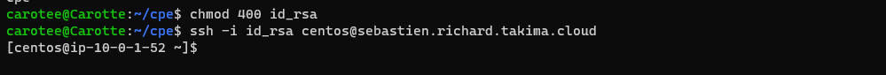
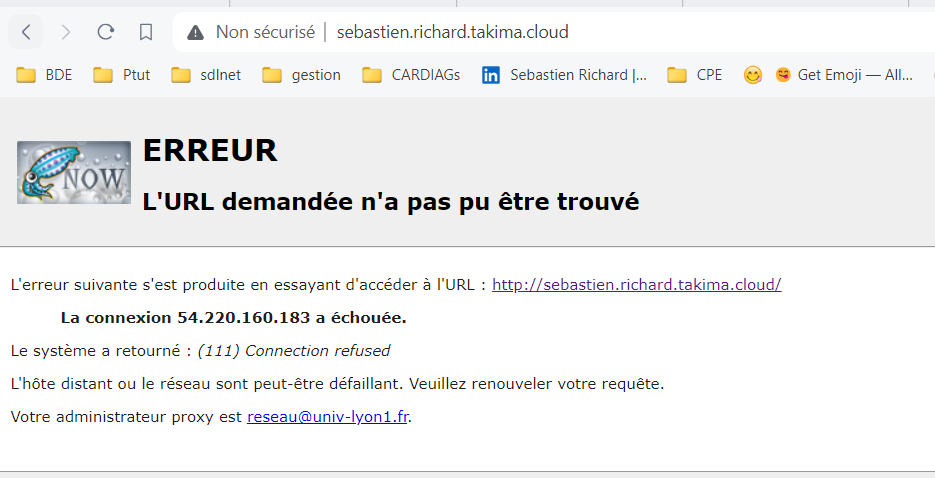

ansible all -m ping --private-key=/home/carotee/cpe/id_rsa -u centos

$ ansible all -m yum -a "name=httpd state=present" --private-key=/home/carotee/cpe/id_rsa -u centos

$ ansible all -m shell -a 'echo "<html><h1>Hello World</h1></html>" >> /var/www/html/index.html' --private-key=/home/carotee/cpe/id_rsa -u centos --become

---
BECOME  !! 
$ ansible all -m shell -a 'echo "<html><h1>Hello World</h1></html>" >> /var/www/html/index.html' --private-key=/home/carotee/cpe/id_rsa -u centos --become

$ ansible all -m service -a "name=httpd state=started" --private-key=/home/carotee/cpe/id_rsa -u centos --become

----

ansible all -i inventories/setup.yml -m ping
/code 

 ansible all -i inventories/setup.yml -m setup -a "filter=ansible_distribution*"
sebastien.richard.takima.cloud | SUCCESS => {
    "ansible_facts": {
        "ansible_distribution": "CentOS",
        "ansible_distribution_file_parsed": true,
        "ansible_distribution_file_path": "/etc/redhat-release",
        "ansible_distribution_file_variety": "RedHat",
        "ansible_distribution_major_version": "7",
        "ansible_distribution_release": "Core",
        "ansible_distribution_version": "7.9",
        "discovered_interpreter_python": "/usr/bin/python"
    },
    "changed": false
}

ansible all -i inventories/setup.yml -m yum -a "name=httpd state=absent" --become

ansible all -i inventories/setup.yml -m yum -a "name=httpd state=present" --become

3$ ansible-playbook -i inventories/setup.yml playbook.yml

PLAY [all] ************************************************************************************************

TASK [Test connection] ************************************************************************************
ok: [sebastien.richard.takima.cloud]

PLAY RECAP ************************************************************************************************
sebastien.richard.takima.cloud : ok=1    changed=0    unreachable=0    failed=0    skipped=0    rescued=0    ignored=0

ansible-galaxy init roles/docker
- Role roles/docker was created successfully

ansible-playbook playbooks/network-test.yaml -e "network=asa"

ansible-galaxy collection install community.docker

change l'ordre dans playbook important

docker network ls

sudo docker network inspect my-network

ansible-playbook -i inventories/setup.yml playbook.yml -vvv

API

database

docker exec <container_id> env

sudo docker exec database env
PATH=/usr/local/sbin:/usr/local/bin:/usr/sbin:/usr/bin:/sbin:/bin
HOSTNAME=d8a2f56b059a
POSTGRES_DB=db
POSTGRES_USER=usr
POSTGRES_PASSWORD=pwd
LANG=en_US.utf8
PG_MAJOR=14
PG_VERSION=14.1
PG_SHA256=4d3c101ea7ae38982f06bdc73758b53727fb6402ecd9382006fa5ecc7c2ca41f
PGDATA=/var/lib/postgresql/data
HOME=/root

docker images -a 

REPOSITORY                                   TAG       IMAGE ID       CREATED             SIZE
carottealpha/tp-devops-simple-api            latest    57c5bb3a16d7   About an hour ago   504MB
carottealpha/tp-devops-simple-api-httpd      latest    02809a79f842   25 hours ago        167MB
carottealpha/tp-devops-simple-api-database   latest    64b12c6bc6c4   25 hours ago        209MB
[root@ip-10-0-1-52 centos]# docker rmi 57c5bb3a16d7
Error response from daemon: conflict: unable to delete 57c5bb3a16d7 (must be forced) - image is being used by stopped container 9568591d4ccc
[root@ip-10-0-1-52 centos]# docker stop  9568591d4ccc
9568591d4ccc
[root@ip-10-0-1-52 centos]# docker rmi 57c5bb3a16d7
Error response from daemon: conflict: unable to delete 57c5bb3a16d7 (must be forced) - image is being used by stopped container 9568591d4ccc
[root@ip-10-0-1-52 centos]# docker rmi -f 57c5bb3a16d7
Untagged: carottealpha/tp-devops-simple-api:latest
Untagged: carottealpha/tp-devops-simple-api@sha256:de27840f8cb7ab6e6577cd3e1fc1bf59ee7da66d035b27efd4a10db867992650
Deleted: sha256:57c5bb3a16d74dffa4464de037e0817ec69f840aced8541efcbcdffe3ba2b84b
[root@ip-10-0-1-52 centos]# docker rmi -f 02809a79f842
Untagged: carottealpha/tp-devops-simple-api-httpd:latest
Untagged: carottealpha/tp-devops-simple-api-httpd@sha256:1354afc67a466df0ce351770e4f34978b85dbc896ac600b8d65a0bf89d7526bf
Deleted: sha256:02809a79f8426f9f55dc44f67417c603fe82e8e54f8ec709bb01864cd6adcf0f
[root@ip-10-0-1-52 centos]# docker rmi -f 64b12c6bc6c4
Untagged: carottealpha/tp-devops-simple-api-database:latest
Untagged: carottealpha/tp-devops-simple-api-database@sha256:db281988c5a5312867e2b521cdf65c02db3cb8217541c1c292a0b1ddaa4fd084
Deleted: sha256:64b12c6bc6c4965717431921508606b1a9966748aa4def874364975d35cc1656
[root@ip-10-0-1-52 centos]# docker images
REPOSITORY   TAG       IMAGE ID   CREATED   SIZE

Supprimer tout !

docker rm -f $(docker ps -a -q) 

safe main.yml network

---
# tasks file for roles/network
- name: Connect multiple containers to the network
  community.docker.docker_network:
    name: my-network
    state: present
    containers:
      - database
      - httpd
      - api
